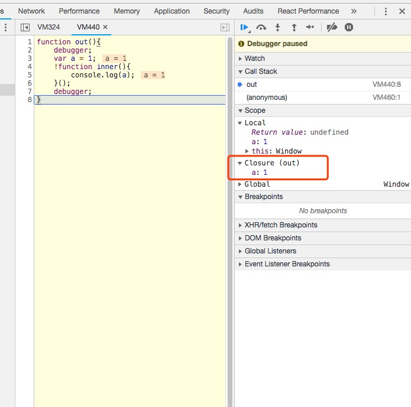

# JS基础总结

## js如何执行

* 对于常见编译型语言（例如：Java）来说，编译步骤分为：词法分析->语法分析->语义检查->代码优化和字节码生成。

* 对于解释型语言（例如 JavaScript）来说，通过词法分析 -> 语法分析 -> 语法树，就可以开始解释执行了。

## js解释执行过程

* js解释器执行代码->可执行代码
  * 词法分析
  * 语法分析
    * 词法语法分析完成后生成AST语法数([AST](https://segmentfault.com/a/1190000016231512))
  * 生成可执行代码
  * 作用域规则确定
* js引擎->执行可执行代码
  * **内存中数据结构：**
    * 代码在内存中被执行，因为js没有严格的区分栈内存、堆内存，可以理解为js所有的数据都是保存在堆内存中，在一些知识中还是要区分堆、栈、列队。
    * 堆内存数据结构(heap)：堆数据结构是一种树状结构，[树](http://data.biancheng.net/view/23.html)。
    * 栈内存数据结构(stack)：先进后出数据结构。
    * 列队(queue):FIFO,先进先出数据结构。
  * **执行上下文：**
    * js代码被执行时，当前的执行环境可以理解为执行上下文。全局执行环境、函数执行环境、eval，多个执行上下文，js引擎会以栈的方式执行它们。
    * 栈底永远是全局执行上下文(global)
    * 当函数被执行时，函数被压入栈中。
  * 执行上下文生命周期(创建、执行)
    * 创建执行上下文：
      * 创建变量对象VO(Variable Object)：
        1. 创建arguments对象
        2. 创建function声明的函数：创建function声明的函数，若已有同名函数存在，替换同命函数的引用(更改指针为新函数地址)。
        3. 创建var声明变量：创建var声明变量并赋值undefined，若以存在与var声明变量同名function，跳过var变量声明。
      * 创建作用域链
        1. 作用域链：由当前环境与上一层环境的一系列变量对象组成，它保证了当前执行环境对符合访问权限的变量和函数的有序访问。
        2. scopeChain：[VO(current),VO(pre),...,VO(global)]
      * 确定this指向
      * **未进入执行阶段之前，变量对象中的属性都不能访问！但是进入执行阶段之后，变量对象转变为了活动对象，里面的属性都能被访问了，然后开始进行执行阶段的操作。**
        ```js
        //栗子
        function test() {
            var a = 1;
            function foo() {
                return 2;
            }
        }
        test();

        // 创建过程
        testEC = {
            // 变量对象
            VO: {},
            scopeChain: {}
        }
        //变量对象创建
        VO = {
            arguments:{...}, //注：在浏览器的展示中，函数的参数可能并不是放在arguments对象中，这里为了方便理解.
            foo:<foo reference>, //表示foo的引用地址
            a:undefined,
            this:window
        }
        ```
    * 执行(当函数处于栈顶)
      * 活动对象：VO->AO(Active Object)
      * 变量赋值
      * function执行
      * 执行其他代码
      ```js
        //VO->AO
        AO={
            arguments:{...},
            foo:<foo reference>,
            a:1,
            this:window
        }
      ```
* **事件循环(Event Loop)**
    * 当执行代码时，执行到setTimeout，setInterval,promise,process.nextTick时，回调会被放入事件循环队列中。
    * 事件循环分为两种
        * 宏任务(macro-task):script(整体代码), setTimeout, setInterval, setImmediate, I/O, UI rendering,等
        * 微任务(micro-task): process.nextTick, Promise, Object.observe(已废弃), MutationObserver(html5新特性),等
    * 事件循环执行顺序：
        * 先从script执行第一次循环，之后全局函数进入调用栈，其他函数被压入栈。
        * 在栈顶执行的函数中：
            1. 执行到macro-task任务，该任务进入macro-task任务列队。
            2. 执行到micro-task任务，该任务进入micro-task任务列队。
        * 执行栈被清空后：
            1. 首先执行一遍微任务(micro-task)任务列队。微任务列队执行完毕。
            2. 执行宏任务(macro-task)列队，这样一直循环下去.
        * 闭包的应用场景
            * 模块化 ：模拟块级作用域，对象内部变量私有化
            * 柯里化 
```js

console.log(1);//同步执行

setTimeout(function(){
    console.log(2);
},1000);//回调函数进入宏任务

const newPromise = function(){
    return new Promise(function(resolve,reject){
    console.log(3); //同步代码直接执行
    resolve();
    console.log(4); //同步代码直接执行
})
}

//then回掉函数进入微任务队列
newPromise().then(function(){
    console.log(5);
})
console.log(6);//同步代码
//1,3,4,6,5,2

```
* **垃圾回收**
    
    * 栈顶函数执行完毕出栈，执行上下文失去引用，等待回收；


* **闭包**
    * 栈顶函数执行完毕出栈，执行上下文没有失去引用。

### **[闭包](https://developer.mozilla.org/zh-CN/docs/Web/JavaScript/Closures)**

* 闭包： 执行上下中A中执行函数，该函数上下文B中引用了A变量对象中的值，就形成了闭包

* 栈顶函数执行完毕出栈，执行上下文没有失去引用。

* 注：使用闭包可以理解为2部分组成（1.定义闭包。2.可使用闭包。） 
    * 定义闭包：是指有权访问另一个函数作用域中的变量的函数，创建闭包的最常见的方式就是在一个函数内创建另一个函数，通过另一个函数访问这个函数的局部变量
    * 可使用闭包：通常是用**return或window.xx=xx**返回是因为要在外部使用闭包变量，可以理解成闭包的使用。

* 使用闭包的优缺
    * 优点：
        1. 希望一个变量长期驻扎在内存中
        2. 避免全局变量的污染
        3. 私有成员的存在
    * 缺点：
        1. 内存浪费。这个内存浪费不仅仅因为它常驻内存，对闭包的使用不当会造成无效内存的产生。


```js

function A(){
    var a= 1;
    return function B(){
        console.log(a);
    }
}

var b = A();
b();//1

function example(){
    var a = 1;
    function exampleInner(){
        console.log(a);
    }
    window.a = exampleInner;
}
example();//生成闭包及外部引用。
a();//访问闭包1

//生成闭包，但是无法被out函数外部使用
function out(){
    var a = 1;
    !function inner(){
        console.log(a);
    }()
}

```


* 闭包的应用场景
    * 模块化，模拟块级作用域，对象内部变量私有化
    ```js
        //块级作用域
        for(var i=1; i<5; i++){
            !function(i){
                setTimeout(function(){
                    console.log(i)
                },i*1000);
            }(i);
        }
        //1,2,3,4
        //es6 let的作用域是块级作用域
        for(let i=1; i<5; i++){
            setTimeout(function(){
                console.log(i)
            },i*1000);
        }
        //1,2,3,4

        //模块化，变量私有化
        (function () {
            var a = 1;
            var b = 2;
            function add(){
                console.log(a+b);
                return a+b;
            }
            window.add = add;
        })();
        add();
        // 使用函数自执行的方式创建模块
        (function(window, undefined) {

            // 声明jQuery构造函数
            var jQuery = function(name) {

                // 主动在构造函数中，返回一个jQuery实例
                return new jQuery.fn.init(name);
            }

            // 添加原型方法
            jQuery.prototype = jQuery.fn = {
                constructor: jQuery,
                init:function() { ... },
                css: function() { ... }
            }
            jQuery.fn.init.prototype = jQuery.fn;

            // 将jQuery改名为$，并将引用保存在window上，形成闭包，对外开发jQuery构造函数，这样我们就可以访问所有挂载在jQuery原型上的方法了
            window.jQuery = window.$ = jQuery;
        })(window);

        // 在使用时，我们直接执行了构造函数，因为在jQuery的构造函数中通过一些手段，返回的是jQuery的实例，所以我们就不用再每次用的时候在自己new了
        $('#div1');
    ```
    * 柯里化 ：
        * 在计算机科学中，柯里化（英语：Currying），又译为卡瑞化或加里化，是把接受多个参数的函数变换成接受一个单一参数（最初函数的第一个参数）的函数，并且返回接受余下的参数而且返回结果的新函数的技术。这个技术由克里斯托弗·斯特雷奇以逻辑学家哈斯凯尔·加里命名的，尽管它是Moses Schönfinkel和戈特洛布·弗雷格发明的。


### this
    
#### this的指向，是在函数被调用的时候确定的。也就是执行上下文被创建时确定的。因此，一个函数中的this指向，可以是非常灵活的。**在函数执行过程中，this一旦被确定，就不可更改了。**

* 函数中this
    * 在一个函数上下文中，this由调用者提供，由调用函数的方式来决定。如果调用者函数，被某一个对象所拥有，那么该函数在调用时，内部的this指向该对象。如果函数独立调用，那么该函数内部的this，则指向undefined。但是在非严格模式中，当this指向undefined时，它会被自动指向全局对象。

    ```js
        var obj = {
            name:'t',
            age:18,
            getName(){
                return this.name;
            }
        }
        //getName被obj所有，调用getName时，this指向obj；
        obj.getName();

        //非严格模式下
        var a = 123;
        function testA(){
            console.log('this: ', this);
            console.log('this.a: ', this.a);
        }
        testA();
        //this:  Window {postMessage: ƒ, blur: ƒ, focus: ƒ, close: ƒ, frames: Window, …}
        //this.a:  123

        //使用严格模式
        function testB() {
            'use strict'
            console.log('this: ', this);
            console.log('this.a: ', this.a);
        }
        testB();
        // this:  undefined
        // Uncaught TypeError: Cannot read property 'a' of undefined
    ```

* 构造函数中this指向实例对象

    ```js

        var _this = null;
        function Person(name,age){
            this.name = name;
            this.age = age;
            _this = this;
            console.log('this: ', this);
        }
        var person = new Person('per',18);
        console.log('person: ', person);
        console.log('_this === person: ', _this === person);
        // this:  Person {name: "per", age: 18}
        // person:  Person {name: "per", age: 18}
        // _this === person:  true


        // new的实现
        const newObj = function (name, age) {
            // 生成this指向新的堆内存空间
            const _this = Object.create({});
            // 给新开辟的堆内存空间赋值
            _this.name = name;
            _this.age = age;
            return _this;
        }
        const test = newObj('test', '18');
        console.log('test: ', test);
        //test:  {name: "test", age: "18"}
        // Object.create 实现
        function newCreate(objPrototype) {
            // 构造函数Fn
            function Fn() { }
            Fn.prototype = objPrototype;
            Fn.prototype.construct = Fn;
            // 调用create后返回新new生成的对象
            return new Fn()
        }
        const testCreate = newCreate({ a: 1 });
        console.log('testCreate.__proto__: ', testCreate.__proto__);
        //testCreate.__proto__:  {a: 1, construct: ƒ}
    ```

* call、apply、bind 改变this的指向

    * call、apply都可以改变调用函数的this指向，只是apply可以接受数组为参数，并且立即调用函数。

    * bind返回的是改变this指向后函数，并没有别调用执行。

    ```js

        var name = '123';
        var objCAB = {
            name:'cab'
        }
        function getName(){
            console.log('this.name: ', this.name);
        }
        getName();//123
        getName.call(objCAB); //cab
        getName.apply(objCAB); //cab
        getName.bind(objCAB)(); //cab

    ```

* call、apply、bind实现

    ```js
        // call实现
        Object.prototype.newCall = function (content) {
            content.fn = this;
            //通过es6 获取 args
            var args = Array.from(new Set(arguments)).slice(1);
            content.fn(...args);
            delete content.fn;
        }
        gets.newCall(objCAB, 111);
        // this.name:  cab
        //  num:  111

        //apply 实现
        Object.prototype.newApply = function (content) {
            content.fn = this;
            //通过es6 获取 args 
            // 通过结构获得  调用newApply传入的数组
            var [args] = Array.from(new Set(arguments)).slice(1);
            content.fn(...args);
            delete content.fn;
        }
        gets.newApply(objCAB, [222]);
        // this.name:  cab
        //  num:  222

        // bind 实现

        Object.prototype.newBind = function(content){
            var _this = this;
            var args = Array.from(new Set(arguments)).slice(1);
            return function(){
                _this.newCall(content,...args);
            }
        }
        var testBind = gets.newBind(objCAB, 333);
        testBind();
        // this.name:  cab
        //  num:  333
    ``` 

## 参考资料

* [前端进阶](https://segmentfault.com/a/1190000017562966)

* [闭包](https://segmentfault.com/a/1190000000652891)

[](https://cheogo.github.io/learn-javascript/201709/runtime.html)
* [ast](https://juejin.im/post/5bfc21d2e51d4544313df666)

* [柯里化](https://segmentfault.com/a/1190000012145489)